# **Traffic Sign Recognition**

---

## **Build a Traffic Sign Recognition Project**

### The goals / steps of this project are the following:

* Load the data set (see below for links to the project data set)
*  Explore, summarize and visualize the data set
* Design, train and test a model architecture
* Use the model to make predictions on new images
* Analyze the softmax probabilities of the new images
* Summarize the results with a written report

## Rubric Points
### Here I will consider the [rubric points](https://review.udacity.com/#!/rubrics/481/view) individually and describe how I addressed each point in my implementation.  

---
### Writeup / README

#### 1. Provide a Writeup / README that includes all the rubric points and how you addressed each one. You can submit your writeup as markdown or pdf. You can use this template as a guide for writing the report. The submission includes the project code.

You're reading it! And here is a link to my [project code]([https://github.com/SynapticSugar/CarND-Traffic-Sign-Classifier-Project])

### Data Set Summary & Exploration

#### 1. Provide a basic summary of the data set. In the code, the analysis should be done using python, numpy and/or pandas methods rather than hardcoding results manually.

I used the python and numpy library to calculate summary statistics of the traffic
signs data set:

* Number of training examples = 34799
* Number of testing examples = 12630
* Number of validation examples = 4410
* Image data shape = (32, 32, 3)
* Number of unique labels = 43

#### 2. Include an exploratory visualization of the dataset.

##### Here is an exploratory visualization of the data set:

The first image shows the distribution of each traffic sign class in the data set. 

This also shows the proportion of training (blue), validation (red), and test (green) samples there are in each classification.

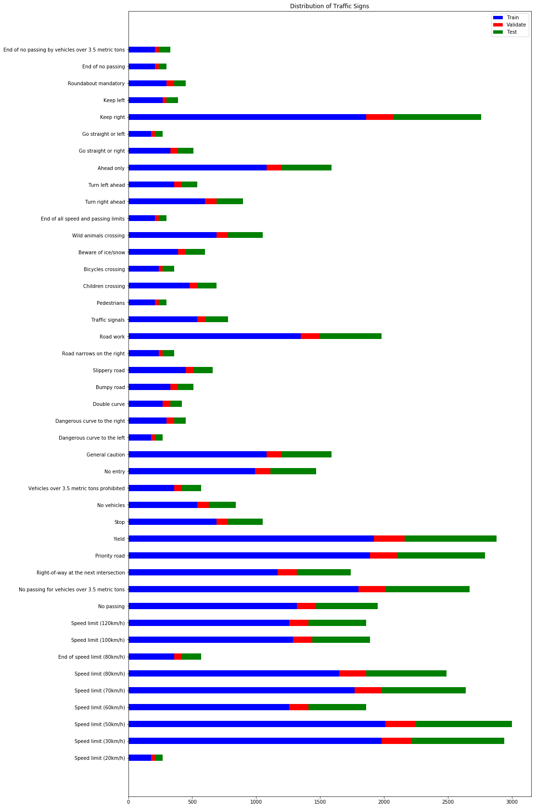

The second image shows an example taken from each of the unique traffic sign labels. 

These images were taken from the training set.

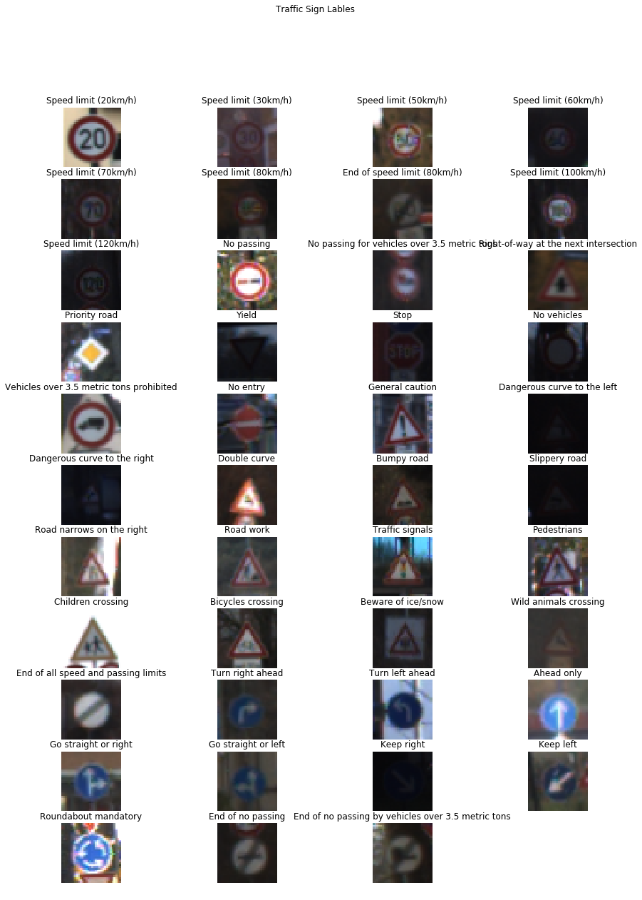

### Design and Test a Model Architecture

#### 1. Provide a describe the preprocessing step

There were two fundamental processing operations that were necessary for training and validating the model. Data augmentation followed by pre-processing. Since pre-processing would be conducted on all the data, augmented, validation, and test sets, it made sense to do this step last. Additionally, it allowed the augmentation step to be independent of pre-process code development variables, like number of channels and colour space conversions.

For the training set augmentation process I added back images from the training set that had undergone a jitter step as described in the [reference paper]([http://yann.lecun.com/exdb/publis/pdf/sermanet-ijcnn-11.pdf) provided. The jitter step consisted of a random x,y translation of up to [2,2] pixels, a rotation between [-15,15] degrees, and a scale change between [.9,1.1].  In addition to jitter, it was found that varying the brightness of the training image was important for achieving a high validation accuracy. This step consisted of introducing a random gamma change between [.3,1.7].  Finally, following the same treatment in the paper, the data set is increased by 500% of the size of the original training set by using this augmentation method. This resulted in a total of 208794 images instead of 34799.

The addition of augmented data had a profound affect on the final test accuracy achieved.

Here is a random example of a traffic sign image before and after augmentation:

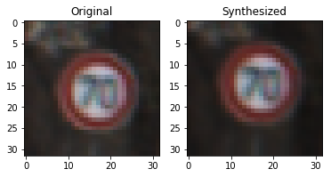

For  the pre-processing step, I converted the images to grayscale and performed histogram equalization using the cv2 library.  The final images were then normalized to a value between -0.5 and 0.5.  This final step was important to ensure that the starting training bias, which started at zero, would not suffer from a poor initial condition.

Here is an example of an original image and a pre-processed image:

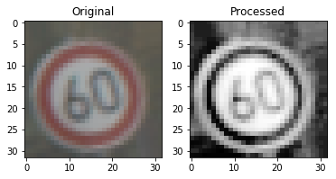

#### 2. Describe what your final model architecture looks like including model type, layers, layer sizes, connectivity, etc.) Consider including a diagram and/or table describing the final model.

My final model consisted of the following layers:

| Layer         	    |     Description	        					| 
|:---------------------:|:---------------------------------------------:| 
| Input         		| 32x32x1 grayscale image   					| 
| Convolution 5x5     	| 1x1 stride, valid padding, outputs 28x28x32 	|
| RELU					|												|
| Max pooling 2x2      	| 2x2 stride,  outputs 14x14x32 				|
| Convolution 5x5	    | 1x1 stride, valid padding, outputs 10x10x64 	|
| RELU					|												|
| Convolution 5x5	    | 1x1 stride, valid padding, outputs 3x3x128 	|
| RELU					|												|
| Max pooling 2x2      	| 2x2 stride, valid padding, outputs 3x3x128	|
| Flatten				| Output 1152	  								|
| Fully connected		| Output 120   									|
| RELU					|												|
| Dropout				|	        									|
| Fully connected		| Output 84   									|
| RELU					|												|
| Dropout				|	        									|
| Fully connected		| Output 43   									|

 

#### 3. Describe how you trained your model. The discussion can include the type of optimizer, the batch size, number of epochs and any hyperparameters such as learning rate.

Hyperparameters:
* Adam Optimizer
* Batch size 128
* Epochs 20
* Learning rate 0.0007

To train the model I used the Adam optimizer.  This optimizer does not include a decaying learning rate as it tunes this dynamically with momentum.  The Adam optimizer converges extremely quickly and generally outperformed the gradient decent optimizer.  The only drawback was more variation in the validation accuracy for a training session.

The batch size was 128.  Although higher batch sizes reduced the training time, they resulted in less validation accuracy.

The number of epochs chosen was 20.  Looking at the visualization graph, it was evident that validation accuracy stopped decreasing at about 10 epochs, which indicates that any further training epochs would cause overfitting.  However, the training loss has not yet leveled out to reach a minima, so 10 more epochs were added to ensure this had happened.

The learning rate was lowered to 0.0007 to reduce overfitting and produce a more gradual training loss curve. 

#### 4. Describe the approach taken for finding a solution and getting the validation set accuracy to be at least 0.93. Include in the discussion the results on the training, validation and test sets and where in the code these were calculated. Your approach may have been an iterative process, in which case, outline the steps you took to get to the final solution and why you chose those steps. Perhaps your solution involved an already well known implementation or architecture. In this case, discuss why you think the architecture is suitable for the current problem.

My final model results were:
* training set accuracy of 99.0%
* validation set accuracy of 98.9%
* test set accuracy of **96.6%**

I choose an iterative method to solve the classification problem.  I started with the LeNet5 model as taught in the course.I found that the test accuracy of the model was just under 93% without any modifications. It was also a convolution network, which is well suited for classification problems and is relatively simple compared with more complex networks like GoogleLeNet and AlexNet.

I altered the classic LeNet5 by adding dropout layers and an extra convolution/Relu layer. A dropout of 0.5 was needed after every hidden fully connected layer in order to reduce overtraining.This was evident by the rise of the validation accuracy and the very high training accuracy.  The extra convolution layer increased the final test accuracy of the DNN by about 2% by increasing the feature map depth significantly.

I found that only 6 feature maps at the first convolution layer did not generalize enough, so I increased the depth to 32 to get more filters.  This resulted in better validation accuracy results.

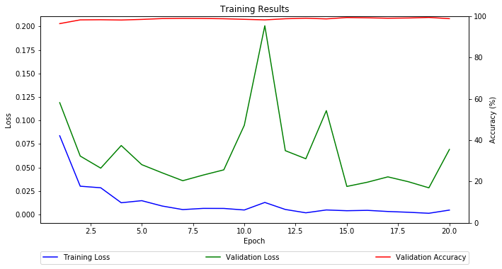

The final model accuracy of 96.6% is fairly close to the validation set accuracy of 98.9%, which shows that the model is working well, but there is still a tiny bit of overtraining left. The fact that the training loss is gradual and does not increase over training shows that the learning rate is correct. This shows that the model is working well for the traffic sign classifier problem.
 
### Test a Model on New Images

#### 1. Choose five German traffic signs found on the web and provide them in the report. For each image, discuss what quality or qualities might be difficult to classify.

Here are five German traffic signs that I found on the web:

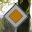
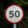
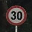

The last two images might be difficult to classify because the sample size of the training set is rather small for those classifications.  The second and third may be hard to classify reliably because they look similar to each other.
I thought the last image would also be a bit challenging since it includes the sky behind it.

#### 2. Discuss the model's predictions on these new traffic signs and compare the results to predicting on the test set. At a minimum, discuss what the predictions were, the accuracy on these new predictions, and compare the accuracy to the accuracy on the test set (OPTIONAL: Discuss the results in more detail as described in the "Stand Out Suggestions" part of the rubric).

Here are the results of the prediction:

|  Image                      |   Predicton               |
|:---------------------------:|:--------------------------|
|  Priority road              |  Priority road            |
|  Speed limit (50km/h)       |  Speed limit (80km/h)     |
|  Speed limit (30km/h)       |  Speed limit (30km/h)     |
|  Go straight or left        |  Go straight or left      |
|  Roundabout mandatory       |  Roundabout mandatory     |

The model was able to correctly guess 4 of the 5 traffic signs, which gives an accuracy of 80%. This compares favorably to the accuracy on the test set of 96.6%. I was surprised that the false prediction of the 50km/h sign had such a high softmax probability and that the 50 km/h sign was not even in the top 5. See plots in the following section 3.

A possible reason for this is that the training set has some fairly poor images for some of the traffic speed signs.  For example, the following image is taken from the training set. There is significant ghosting of the numbers and it is very hard to tell if it belongs to the 80, 30, or 50 km/h speed signs.  This will definitely make it harder to train the model with images like this. The post processing does little to remedy the situation.

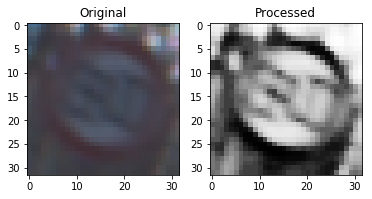

#### 3. Describe how certain the model is when predicting on each of the five new images by looking at the softmax probabilities for each prediction. Provide the top 5 softmax probabilities for each image along with the sign type of each probability. (OPTIONAL: as described in the "Stand Out Suggestions" part of the rubric, visualizations can also be provided such as bar charts)

The code for making predictions on my final model is located in the 15th cell of the Ipython notebook.

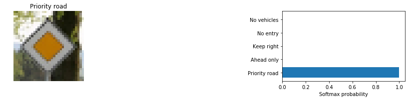
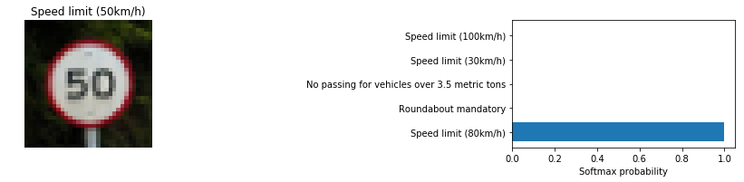
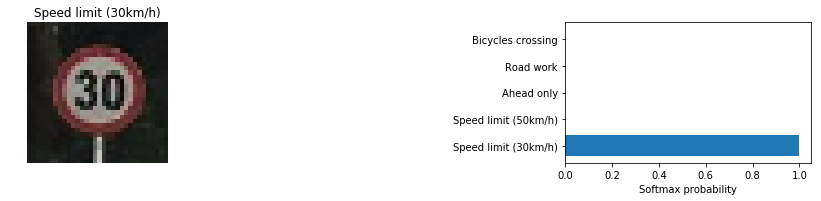
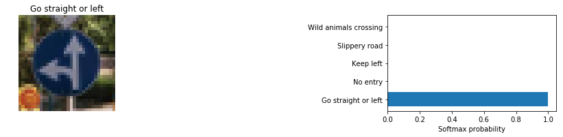
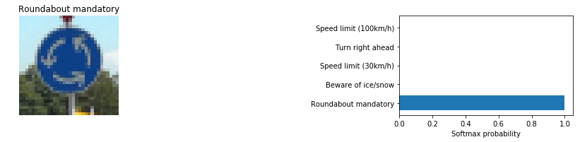

For the second image, the model is relatively sure that this is a speed limit (80 km/h) sign (probability of ~ 100% ), but the image is in fact a speed limit (50 km/h). It was expected that other speed limits signs made it into the top five as they are very similar.
It is surprising that the actual label did not make it into the top five.  

The rest of the images have the correct recall with softmax probablities that are very close to 100%.

### (Optional) Visualizing the Neural Network (See Step 4 of the Ipython notebook for more details)
#### 1. Discuss the visual output of your trained network's feature maps. What characteristics did the neural network use to make classifications?

I decided to run the wild image that was falsly classified through the visualizer:

Layer one is the output of the first convolution layer and shows the effect of the weights and biases for each of the 32 filters. There are several 45 degree (9, 16, 20, and 23), horizontal (8, 17, and 17), and vertical (2, 7, 24, and 26) filters. There are also features that look like a threshold was applied. See 3 and 23. There are also some filters which seem to be composits of the above filters. In general this layer is looking at edges.

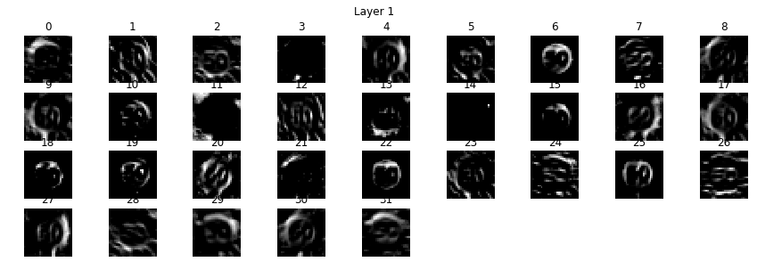

Layer two has more depth but less width and height.  This layer is harder for humans to understand what is happening inside these filters. This layer would be looking for small features that make up a sign.

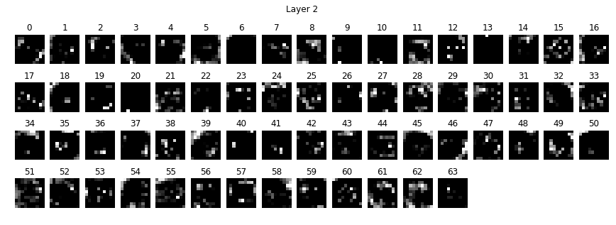

Layer three has very little spatial information for each filter, but there is more of them to generalize the classification problem. This layer would be identifying a particlular type of traffic sign.

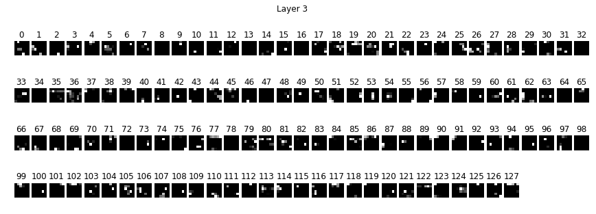

